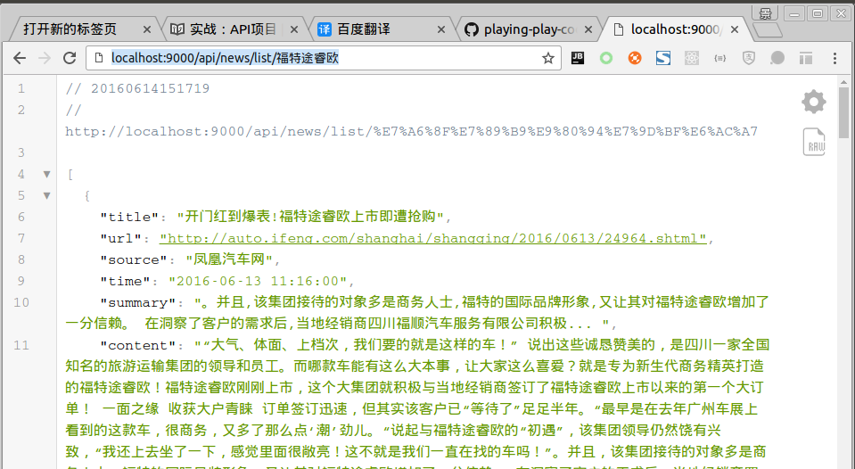

# 实战：API项目

*本文代码见：<a target="_blank" href="https://github.com/yangbajing/playing-play-code/tree/master/apis">playing-play-apis</a>*

在了解了Play在WEB开发方面的功能和类之间的依赖管理后，我们现在开始一个实战项目。现在微服务的概念风起云涌，这一章的实战项目就来实现一个 **API项目** ，
这章的实战项目会告诉你怎样使用 Play 来开发一个API项目，综合运用到了：Controller、Action、Result、依赖注入等特性。

我们会开发一个API项目，这是一个新闻聚合API项目。它提供接口让用户可关键词实时搜索新闻，新闻来源来自“百度新闻”。
接下来的几章我们会基于这个“API项目”不断完善，从现在一开始的接口定义、服务实现，到在线爬取新闻，最后对爬取数据的存储。
我们将使用`play-ws`来做异步爬虫，`Jsoup`来解析新闻网页，`akka-actor`来做新闻任务的分发与聚合，`reactivemongo`来存储爬取的新闻数据。

现在，让我们来实现第一部分：定义API接口和服务。

## 定义API

首先我们定义新闻接口的API:

```scala
GET        /api/news/list/:word        controllers.api.NewsController.getListByWord(word: String, maxSize: Option[Int], earliestTime: Option[String], mode: Option[String], timeout: Option[Int])
```

这里我们提供了5个查询参数：

1. word: 待查询新闻的关键词
0. maxSize: 最大抓取新闻条数
0. earliestTime: 限制新闻时间，若设置将只抓取晚于此时间的新闻
0. mode: 新闻抓取方式，有两种。`S`：只抓取摘要，`F`：同时抓取全文
0. timeout: 抓取超时时间，单位为秒。若超时到就直接返回已抓取新闻

## 定义Controllers

在 `NewsController` 的主构造函数，我们注入了 `NewsService` 服务。在调用 `newsService.findListByWord` 方法
时，需要把从 "controller" 获得的 HTTP 请求参数做一些转换以符合 `findListByWord` 方法参数的定义。

```scala
@Singleton
class NewsController @Inject()(newsService: NewsService
                              )(implicit ec: ExecutionContext) extends Controller {

  def getListByWord(word: String,
                    maxSize: Option[Int],
                    earliestTime: Option[String],
                    mode: Option[String],
                    timeout: Option[Int]) = Action.async {
    newsService.findListByWord(
      word,
      maxSize.getOrElse(NewsItem.DEFAULT_MAX_SIZE),
      earliestTime,
      mode.map(SearchMode.withName).getOrElse(SearchMode.F),
      scala.math.min(timeout.getOrElse(NewsItem.DEFAULT_MAX_TIMEOUT), NewsItem.DEFAULT_MAX_TIMEOUT).seconds
    ).map { list =>
      Ok(Json.toJson(list))
    }
  }

}
```

## 定义服务

新闻接口服务的定义非常简单，现在让我们先忽略抓取百度新闻部分。我们使用一个`NewsServiceMock`从JSON文件内读取一些新闻。
新闻数据在`conf/news.json`文本文件内。

```scala
@Singleton
class NewsService @Inject()(newsData: NewsData) {

  def findListByWord(word: String,
                     maxSize: Int,
                     earliestTime: Option[String],
                     mode: SearchMode,
                     duration: FiniteDuration): Future[Seq[NewsItem]] = {
    Future.successful(newsData.newsList.filter(item => item.time.contains(word)))
  }

}

@Singleton
class NewsData @Inject()(environment: Environment) {

  def newsList: Seq[NewsItem] =
    environment.resourceAsStream("news.json").map(in =>
      try {
        Json.parse(in).as[Seq[NewsItem]]
      } finally {
        in.close()
      }
    ).getOrElse(Nil)

}
```

这里有一个新的类：`play.api.Environment`，它提供了一些访问 Play 应用环境的方法。比如 `environment.mode` 可以知道 Play 处于什么运行状态。
而 `enviroment.getFile` 和 `enviroment.resourceAsStream` 等可以获取 Play 应用本身的文件资源。

## 测试

```
cd apis
./sbt run
```

打开浏览器访问：`http://localhost:9000/api/news/list/福特途瑞欧`，可以看到返回的新闻数据。



## 总结

本示例讲述了怎样使用 Play 开发一个 REST 风格的 API 项目。这是“新闻聚合API”实战项目三部曲的第一部。

之后的第二部将讲述怎样使用 `play-ws` 和 `jsoup` 开发一个百度新闻异步爬虫，以使这个“新闻API”具有实时获取新闻的能力。

而在第三部中，将加入 `reactivemongo` ，我们会把爬取的新闻存储到 MongoDB 数据库中。这样当第二次请求相同关键词时就不需要再向百度新闻发起请求了。
