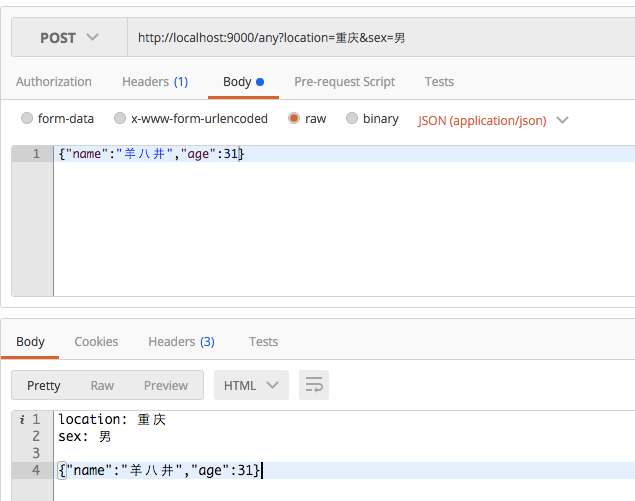

# 控制路由和响应结果

Play应用有一个基本概念：<a target="_blank" href="https://playframework.com/documentation/2.5.x/ScalaActions">Action, Controllers and Results</a> ，Play应用的基本流程可以概述于此。

- Controller: 控制器分发请求
- Action: Play 应用的大部分请求都是由Action的处理
- Result: Action处理完请求后将返回 `play.api.mvc.Result`，Play 将响应结果到前端。 

## Action

一个 `Action` 基本上都是一个实现了 (`play.api.mvc.Request => play.api.mvc.Result`) 的函数，它处理请求并生成响应发送到客户端。

```scala
def echo = Action { request =>
  Ok("Got request [" + request + "]")
}
```

这个示例 Action 返回一段字符串到前端。示例中使用了 `Ok` 来构造一个响应状态码为： `200 Ok`，响应类型（Content-Type）为：`text/plain`的内容。

有多种方式来构造 Action 代码块，除了刚才看到的。还有一种更简洁的方式（当你不关心请求内容时）：

```scala
def index = Action {
  Ok("Hello world")
}
```

`Request` 对象有一个body函数，我们可以通过他获取用户提交的内容（Http Entity）。默认它返回的是 `play.api.mvc.AnyContent` 类型，调用它的 `asFormUrlEncoded`、`asText`、`asXml`、`asJson`等方法可以获取相要的数据类型。但是我们有更方便的方式，比如当我们确定或要求客户端必需提交一段`Json`时，就可以使用 Play 提供的 `BodyParse` 工具类上的各种工具来自动解析（转换）客户端提交内容为指定格式。

```scala
def echo = Action(parse.json) { request =>
    Ok(request.body) // 原样返回json内容给前端
}
```

## Controllers

Controller（控制器）是一个普通的类，可以在里面定义很多的 Action ，还可以通过 <a target="_blank" href="https://playframework.com/documentation/2.5.x/ScalaDependencyInjection">依赖注入</a> 来注入需要的服务对象（从Play 2.4开始，Play官方推荐使用依赖注入来管理对象生命周期及类依赖，同时也推荐使用 `class` 来定义路由。在Play 2.5中，使用类定义路由已成为默认方式）。

一个简单的控制器类主义如下：

```scala
package controllers

import play.api.mvc._

class AppController extends Controller {
  def index = Action {
    Ok("Hello, Play!")
  }

  def echo = Action(parse.json) { request =>
    Ok(request.body) // 原样返回json内容给前端
  }
}
```

通常，我们需要把控制器定义在 `controllers` 包路径（包括子包）下，不然 Play 应用将不能找到控制器。

除了可以定义没有参数的 Action ，还可以定义有参数的 Action：

```scala
def hello(name: String) = Action {
  Ok("Hello " + name)
}
```

## Results

Play 的 `Result` 对象非常简单，它只需要两个参数：`header`设置Http响应头 和 `body`设置返回给前端的内容：

```scala
import play.api.http.HttpEntity

def index = Action {
  Result(
    header = ResponseHeader(200, Map.empty),
    body = HttpEntity.Strict(ByteString("Hello world!"), Some("text/plain"))
  )
}
```

有一些常用创建 `Result` 的方法：

```scala
val ok = Ok("Hello world!")
val notFound = NotFound
val pageNotFound = NotFound(<h1>Page not found</h1>)
val badRequest = BadRequest(views.html.form(formWithErrors))
val oops = InternalServerError("Oops")
val anyStatus = Status(488)("Strange response type")
```

## Routes

路由，它决定的用户的请求被路由到哪个 Controller 并最终被分发给哪个 Action 处理。同时，在路由上我们还可以对请求参数作解析。

路由通常定义在 Play 项目的 `conf/routes` 文件类，每个跌幅占一行：

```scala
GET         /              controllers.AppController.index
```

每个路由定义有3部分：

- 第一个指明Http Method，有：`GET`、`POST`、`PUT`、`DELETE`、`HEAD`、`OPTIONS`，
- 第二个定义访问 URI
- 第三个确定路由将被分发到哪个控制器的哪个动作（Action）上

除了可以定义“无参”的路由，我们还可以在路由定义上指定需要的请求参数：

```scala
GET         /hello         controllers.AppController.hello(age: Int)
GET         /hello2        controllers.AppController.hello2(name: String, age: Option[Int], email: String = "未知")
```

上面定义了两个路由，第一个路由 `/hello` 有一个参数：`age`，它的类型是：`Int`。当客户端提交的请求不符合要求时 Play 应用将返回一个错误消息到前端。


第二个路由 `/hello2` 有3个参数，分别是字符串类型的 `name`、32位整形类型 `age` 和字符串类型的`email`。其中第2个参数：`age` 是可选参数。第3个参数也是可先参数，同时它还有一个默认值：未知。


## 技巧

除了在路由定义上指定需要的请求参数外，我们还可以使用 `Request` 对象上的 `getQueryString` 和 `queryString` 方法获取请求参数：

```scala
val maybeName: Option[String] = request.queryString("name")
```

**示例**

*echo客户端提交的所有请求参数和文本内容*

```scala
// 路由
POST         /any           controllers.AppController.any

// Action
def any = Action { request =>
  val queryStrings = request.queryString
    .map { case (name, values) => s"$name: ${values.mkString(",")}" }
    .mkString("\n")
  val body = request.body.asBytes().map(_.utf8String).getOrElse("")
}
```



## 总结

本文介绍了 Play 应用开发中常用的：Controllers、Actions和Results，还使用实际例子演示了不同 Play 中路由定义的不同方式。最后以一个小技巧获取客户端提交的所有请求参数和 `Http Entity` 文本内容。

**本文代码在：<a target="_blank" href="https://github.com/yangbajing/playing-play-code/tree/master/mvc">Github: playing-play-code:mvc</a>**
